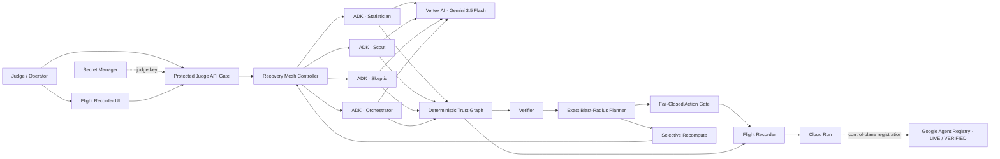

# EvidenceBound Recovery Mesh

[](https://evidencebound-recovery-mesh-i3lzjodgra-ew.a.run.app/)


> Trust-aware flight recorder and selective self-healing engine for autonomous agent fleets.

When one evidence or agent checkpoint becomes untrustworthy, Recovery Mesh does **not** restart the whole fleet. It freezes unsafe action, computes the exact downstream trust blast radius, preserves still-verifiable checkpoints, recomputes only the affected branch, re-verifies it, and resumes only after the final deterministic policy gate passes.

## Judge moment

```text
TRUST BREAK
  -> BLAST RADIUS
  -> ACTION BLOCKED
  -> SAFE WORK REUSED
  -> AFFECTED BRANCH RECOMPUTED
  -> VERIFIED RECOVERY
```

The Flight Recorder renders this sequence from real runtime state. Gemini can reason and produce bounded structured output, but it cannot mark checkpoints VERIFIED, choose the blast radius, override provenance/policy checks, or authorize the final action.

## Current production deployment — 2026-08-15

| Gate | Receipt |
|---|---|
| Cloud Run | `PASS` |
| Current revision | `evidencebound-recovery-mesh-00005-82k` |
| Vertex AI | `gemini-3.5-flash` |
| Google agent framework | ADK `2.7.0` |
| Google Agent Registry | `PASS` — fleet entry point registered + read-only Agent discovery verified |
| Agent Registry Service | `projects/evidencebound-rm-c977c1/locations/global/services/recovery-mesh-fleet` |
| Agent Registry workflow | `31871557186` |
| Protected judge API | unauthenticated `POST /api/runs` -> `401` |
| Live baseline | `4` Google ADK agents |
| Controlled trust break | `PASS` |
| Unsafe action | `publish_action = BLOCKED` |
| Reused work | `scout` preserved |
| Selective recovery | `3` agents rerun, `1` agent reused |
| Final action | `VERIFIED` |
| Current revision smoke run | `run-439f7d87c2a3` |

The current revision's deployment smoke measured:

```text
Full restart:        4 model calls / 1728 input tokens
Selective recovery: 3 model calls / 1393 input tokens
Saved:               1 model call / 335 input tokens (~19%)
```

### Reference acceptance benchmark

The earlier production acceptance run `run-4707af5a2fb6` measured:

```text
Full restart:        4 model calls / 1781 input tokens
Selective recovery: 3 model calls / 1358 input tokens
Saved:               1 model call / 423 input tokens (~24%)
```

Both are controlled-run measurements, not general savings claims. Token counts vary across live Gemini executions; the Flight Recorder therefore displays each run's actual receipt rather than a hard-coded percentage.

### Verified Agent Registry receipt

Recovery Mesh is manually registered in **Google Agent Registry** as the discoverable fleet entry point for the existing Cloud Run service. Registration is control-plane only: it did not change the Recovery Mesh backend, Cloud Run revision, judge API, runtime behavior, Gemini model configuration, or internal Trust Graph semantics.

```text
AGENT_REGISTRY=PASS operation=created location=global transport=rest-v1 discovery=service-registry-resource
AGENT_REGISTRY_SERVICE=projects/evidencebound-rm-c977c1/locations/global/services/recovery-mesh-fleet
AGENT_REGISTRY_AGENT=projects/457699623691/locations/global/agents/agentregistry-00000000-0000-0000-a7f5-b9837959f789
AGENT_REGISTRY_INTERFACE=https://evidencebound-recovery-mesh-i3lzjodgra-ew.a.run.app
AGENT_REGISTRY_DISCOVERY=PASS
```

The Registry entry represents the **Recovery Mesh fleet entry point**. This submission does not claim that each of the four internal ADK roles is separately registered.

## Live judge UI

Hosted Flight Recorder:

```text
https://evidencebound-recovery-mesh-i3lzjodgra-ew.a.run.app/
```

Fastest judge path:

```text
https://evidencebound-recovery-mesh-i3lzjodgra-ew.a.run.app/?autorun=stale_evidence
```

The action APIs are protected. Enter the private testing key supplied in the Devpost judge-only instructions. The browser keeps it only in tab-scoped `sessionStorage` and sends it as `X-Recovery-Mesh-Judge-Key`.

After unlock, the autorun URL creates a **fresh live Google ADK / Gemini baseline** and injects the controlled stale-evidence fault through the same production API. The graph then shows `history_snapshot · TRUST BREAK`, the exact contaminated branch, blocked `publish_action`, and `scout · REUSED`. Click **Autonomous selective recovery** to rerun only the affected branch and produce the measured recovery receipt.

Historical production run IDs above are audit receipts, but run objects are intentionally process-local in this bounded demo. They are **not** presented as durable permalinks after Cloud Run scales to zero. Judges should use the fresh autorun path above for reproducible live verification.

Detailed judge steps: [`docs/JUDGE_TESTING_INSTRUCTIONS.md`](docs/JUDGE_TESTING_INSTRUCTIONS.md).

## Architecture



Canonical architecture notes: [`docs/ARCHITECTURE.md`](docs/ARCHITECTURE.md).

### Enterprise persistence boundary — verified submission scope

The live judge deployment validates the Recovery Mesh recovery control plane with a **process-local in-memory hot store**. That is the current verified runtime boundary; durable cross-session or multi-week persistence is **not** claimed in the live submission.

The Flight Recorder already emits typed `FlightEvent` records and checkpoint objects with stable run/checkpoint IDs, dependency metadata, digests, policy version, provenance, integrity state and timestamps. Those structured records form the persistence boundary. In an enterprise deployment, a **separately verified** durable adapter can persist the same records to services such as **Firestore** for cross-session operational state and route audit history to **BigQuery / Cloud Logging** for long-retention analysis. Those services are **enterprise extension targets, not active integrations in this submission**.

This separation is architectural, not a claim that a future persistence box satisfies the Fortified multi-week-context requirement today. Deterministic trust, invalidation, blast-radius, reuse and action-gating semantics remain independent of the storage provider. A durable provider changes retention and restart survivability; it does not gain authority to mark state trusted or authorize an action.

## Trust graph

```text
fixture_snapshot -----+----> statistician ----+
                      |                        |
history_snapshot -----+                        +--> skeptic --> orchestrator --> publish_action
                      |                        |                   ^
                      +----> scout ------------+                   |
policy_rules -----------------------------------------------------+
```

Minimum checkpoint states are `VERIFIED`, `INVALIDATED`, `RECOMPUTE`, and `BLOCKED`.

Every material checkpoint binds run/checkpoint/agent IDs and versions, dependency checkpoint IDs, parent output digests, evidence/tool digests, policy version, output digest, verification state, provenance/integrity metadata, and timestamps where applicable.

## Controlled trust breaks

All demo faults are visibly labeled controlled faults and enter the same runtime contracts used by verification:

- `stale_evidence` — invalidates `history_snapshot` and its exact downstream branch;
- `malformed_worker` — strict worker-output schema failure;
- `policy_drift` — policy version drift invalidates policy-dependent state.

The Recovery Mesh computes the rerun plan. The judge does not choose which agents rerun.

## Reproduce locally

Requirements: Python 3.12+.

```bash
git clone https://github.com/moneyparking/evidencebound-recovery-mesh.git
cd evidencebound-recovery-mesh
python -m venv .venv
source .venv/bin/activate   # Windows: .venv\Scripts\activate
python -m pip install -e '.[dev]'
pytest
PYTHONPATH=src uvicorn recovery_mesh.api:app --host 127.0.0.1 --port 8080
```

Open `http://127.0.0.1:8080`.

Credential-free local mode is deterministic and **does not claim Gemini execution**. Production Google execution uses:

```text
RECOVERY_MESH_EXECUTION_MODE=google_adk
GOOGLE_GENAI_USE_VERTEXAI=TRUE
RECOVERY_MESH_MODEL=gemini-3.5-flash
```

## Verification gates

```bash
ruff check .
mypy src/recovery_mesh
pytest --cov=recovery_mesh --cov-report=term-missing
python -m py_compile app/agent.py src/recovery_mesh/*.py scripts/benchmark-scale.py
node --check static/app.js
PYTHONPATH=src python scripts/benchmark-scale.py
```

CI additionally validates shell entrypoints, the production smoke harness, judge-facing UI contracts, secret scanning, the exact deterministic scale receipt, and a Docker build.

The deterministic scale probe exercises **100 synthetic agent checkpoints** with the same blast-radius planner and locks the controlled receipt to `14 affected / 86 reused / 1 blocked action`. It is explicitly not evidence of 100 live Gemini calls.

## Google Cloud deployment

Production target:

```text
Project: evidencebound-rm-c977c1
Cloud Run region: europe-west1
Vertex location: global
Runtime SA: recovery-mesh-runtime@evidencebound-rm-c977c1.iam.gserviceaccount.com
Build SA: recovery-mesh-build@evidencebound-rm-c977c1.iam.gserviceaccount.com
Model: gemini-3.5-flash
Health: /health
Agent Registry location: global
Agent Registry Service: recovery-mesh-fleet
```

Deployment is bounded to Cloud Run `min=0`, `max=1`, one CPU and 512 MiB. GitHub deploys keylessly through Workload Identity Federation restricted to this repository, owner, and `main` branch. Each production deploy performs a live Vertex/Gemini preflight and protected end-to-end recovery smoke.

Agent Registry registration is a separate main-only, keyless control-plane workflow. It uses the existing WIF deployer identity, waits for the Google long-running operation, and fails closed unless the generated read-only Agent is observable before reporting PASS.

## Security and trust boundary

- no API keys or judge credentials in source or public UI;
- judge key stored in Google Secret Manager;
- state-changing/read-run APIs reject unauthenticated access before model execution;
- no silent fallback from failed Google execution to deterministic output;
- Gemini worker output is constrained to strict `WorkerOutput` JSON and allowed Trust Graph dependency IDs;
- deterministic trust, provenance, integrity and policy gates remain authoritative;
- side effects are fail-closed and idempotency-protected;
- live model calls are process-bounded to reduce accidental public-demo traffic;
- Agent Registry is catalog/discovery control plane only and does not override Recovery Mesh trust state or action authorization.

## Fortified Enterprise Fleet scope note

Recovery Mesh is the fleet-integrity and selective-recovery plane for a Fortified Enterprise deployment. The current judge slice demonstrates four specialized ADK agents, deterministic contamination propagation, fail-closed action, exact blast radius, selective recomputation, audit events, Google Cloud deployment, protected access, bounded service identities, **and a live Google Agent Registry catalog/discovery entry for the Recovery Mesh fleet endpoint**.

It does **not** claim that the process-local demo store provides multi-week context. It also does not claim Agent Runtime, Memory Bank, Model Armor, Firestore persistence, BigQuery export, or separate Registry entries for each internal ADK role without a separately verified integration.

## New-project disclosure

This is a new isolated project created during the August 2026 submission period. No SignalReview production source or prior EvidenceBound implementation source is copied into this repository. Pre-existing concepts and the clean-room boundary are disclosed in [`PREEXISTING_WORK.md`](PREEXISTING_WORK.md).

## Judge evidence map

- [`docs/ARCHITECTURE.md`](docs/ARCHITECTURE.md) — architecture and trust boundaries
- [`docs/THREAT_MODEL.md`](docs/THREAT_MODEL.md) — threats, controls, and explicit non-claims
- [`docs/JUDGE_ACCEPTANCE.md`](docs/JUDGE_ACCEPTANCE.md) — acceptance gates
- [`docs/DEVPOST_SUBMISSION_MATRIX.md`](docs/DEVPOST_SUBMISSION_MATRIX.md) — submission evidence matrix
- [`docs/PROOF_OF_ACTION_VIDEO.md`](docs/PROOF_OF_ACTION_VIDEO.md) — <=4-minute recording plan

## Scope discipline

Recovery Mesh is the submitted product. SignalReview concepts may inform the bounded workload, but no production SignalReview source is included. AdsForge is not part of the judge-ready core and is intentionally excluded unless a separate, verified integration can be added without destabilizing this submission.
