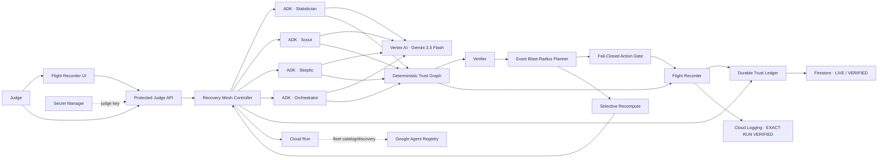

# EvidenceBound Recovery Mesh

[](https://evidencebound-recovery-mesh-i3lzjodgra-ew.a.run.app/)


> Trust-aware flight recorder and selective self-healing engine for autonomous agent fleets.

When one evidence or agent checkpoint becomes untrustworthy, Recovery Mesh does **not** restart the whole fleet. It freezes unsafe action, computes the exact downstream trust blast radius, preserves still-verifiable checkpoints, recomputes only the affected branch, re-verifies it, and resumes only after the final deterministic policy gate passes.

## Judge moment

```text
TRUST BREAK
  -> EXACT BLAST RADIUS
  -> ACTION BLOCKED
  -> SAFE WORK REUSED
  -> AFFECTED BRANCH RECOMPUTED
  -> VERIFIED RECOVERY
```

Gemini can reason and produce bounded structured output, but it cannot mark checkpoints `VERIFIED`, choose the blast radius, override provenance/integrity/policy checks, trust persisted state merely because it exists, or authorize the final action.

**Final public judge video:** https://youtu.be/3OtS17yf-Xo

## Twist / what is novel

Recovery Mesh treats **trust itself as a repairable dependency graph**. Instead of choosing between “restart everything” and “continue from contaminated state,” it computes a deterministic minimal repair set, preserves checkpoints that still verify, and reruns only the affected branch.

Three additional boundaries make that useful for enterprise fleets:

- **persisted state is not trusted state** — Firestore durability never bypasses revalidation;
- **fail-closed durable side effects** — production proves `0` receipts while BLOCKED and exactly `1` after verified recovery;
- **model/authority separation** — Gemini reasons, while deterministic Recovery Mesh code owns trust state, blast radius, policy and action authorization.

The same `run_id` binds the Flight Recorder, Firestore state and independently queried Google Cloud Logging evidence.

### Unlikely Hero workload

The judge workload models a **football performance / match-intelligence operations analyst** whose autonomous fleet must not publish a recommendation derived from stale, malformed or policy-invalid evidence. The workload uses safe controlled fixture/history/policy data; it does not claim live sports-provider truth or copy SignalReview production source.

## Current fortified production deployment — 2026-08-28

| Gate | Current receipt |
|---|---|
| Cloud Run | `PASS` |
| Revision | `evidencebound-recovery-mesh-00007-bjm` |
| Deployment workflow | `33196157041` — SUCCESS |
| Fresh live acceptance + cloud proof | `33196523402` — SUCCESS |
| Acceptance run | `run-4f1eba151be7` |
| Vertex AI | `gemini-3.5-flash` |
| Google agent framework | ADK `2.7.0` |
| Persistence | Firestore Durable Trust Ledger, `durable=true` |
| Firestore database | `(default)`, `europe-west1` |
| Exact-run Cloud Logging | `PASS` |
| Protected judge API | unauthenticated `POST /api/runs -> 401` |
| Live baseline | `4` Google ADK agents |
| Controlled trust break | `history_snapshot / STALE_EVIDENCE` |
| Unsafe action | `publish_action = BLOCKED` |
| Blocked durable receipt count | `0` |
| Safe work reused | `Scout` |
| Selective recovery | `3` agents rerun / `1` reused |
| Recovered durable receipt count | `1` |
| Rehydration | trusted only after deterministic validation |
| Final action | `VERIFIED` |
| Google Agent Registry | fleet entry point registered and discoverable |

Measured values for `run-4f1eba151be7` only:

```text
Full restart:        4 model calls / 1707 input tokens
Selective recovery: 3 model calls / 1432 input tokens
Saved in this run:   1 model call / 275 input tokens (~16.1%)
```

This is a controlled-run measurement, not a general savings claim. Gemini token usage varies between executions, so the Flight Recorder displays the current run's actual receipt.

Canonical production receipt: [`docs/FORTIFIED_PRODUCTION_RECEIPT_2026-08-28.md`](docs/FORTIFIED_PRODUCTION_RECEIPT_2026-08-28.md).

## Durable Trust Ledger

The current revision uses Firestore as an active production persistence layer for run snapshots, Flight Recorder events and idempotent action receipts.

The live acceptance proved the fail-closed receipt invariant:

```text
FIRESTORE_BLOCKED_RECEIPT_COUNT=PASS count=0 run_id=run-4f1eba151be7
DURABLE_BLOCKED=PASS action=BLOCKED receipt=absent persisted_trust=validated
DURABLE_RECOVERY=PASS receipt=present rehydration=trusted
FIRESTORE_RECOVERED_RECEIPT_COUNT=PASS count=1 run_id=run-4f1eba151be7
```

Persisted state is **not automatically trusted memory**. Recovery Mesh revalidates dependency/input digests, provenance, integrity and active policy before persisted checkpoints may be reused.

The exact production acceptance did not deliberately kill a Cloud Run instance between persistence and replay. Repository tests cover crash/restart semantics; the live receipt proves the active Firestore data path, durable receipt cardinality and deterministic rehydration gate on revision `00007-bjm`.

## Exact-run Google Cloud audit proof

Workflow `33196523402` uses a separate read-only auditor identity for the second job. It queried Google Cloud Logging for the same acceptance run generated by the live judge job:

```text
PROOF_RUN_ID=run-4f1eba151be7
EXACT_RUN_CLOUD_LOGGING=PASS
GCP_PROOF_RECEIPT=PASS
```

The observed production causal sequence includes:

```text
TRUST_BREAK_DETECTED
BLAST_RADIUS_COMPUTED
ACTION_BLOCKED
CHECKPOINT_REUSED
RECOMPUTE_STARTED
CHECKPOINT_REVERIFIED
ACTION_RESUMED
RECOVERY_COMPLETED
```

Cloud Logging provides external audit evidence. It does not participate in trust authorization.

## Live judge UI

Hosted Flight Recorder:

```text
https://evidencebound-recovery-mesh-i3lzjodgra-ew.a.run.app/
```

Preferred hands-off Proof-of-Action route:

```text
https://evidencebound-recovery-mesh-i3lzjodgra-ew.a.run.app/?autorun=stale_evidence&recover=1
```

The action APIs are protected. Enter the private testing key supplied in the Devpost judge-only instructions. The browser keeps it only in tab-scoped `sessionStorage` and sends it as `X-Recovery-Mesh-Judge-Key`.

After unlock, no human recovery action is required. The app creates a fresh Google ADK / Gemini baseline, injects the controlled stale-evidence fault through the production API, freezes the unsafe action, computes the exact repair set, reuses still-verifiable work, selectively recomputes the contaminated branch, persists the recovery ledger, and resumes only after deterministic re-verification.

Manual inspection route:

```text
https://evidencebound-recovery-mesh-i3lzjodgra-ew.a.run.app/?autorun=stale_evidence
```

The manual route intentionally pauses in the incident state so judges can inspect the blast radius before clicking **3 · Autonomous selective recovery**.

Detailed steps: [`docs/JUDGE_TESTING_INSTRUCTIONS.md`](docs/JUDGE_TESTING_INSTRUCTIONS.md).

## Architecture



Canonical architecture source: [`docs/ARCHITECTURE.md`](docs/ARCHITECTURE.md).

## Trust graph

```text
fixture_snapshot -----+----> statistician ----+
                      |                        |
history_snapshot -----+                        +--> skeptic --> orchestrator --> publish_action
                      |                        |                   ^
                      +----> scout ------------+                   |
policy_rules -----------------------------------------------------+
```

Minimum checkpoint states are `VERIFIED`, `INVALIDATED`, `RECOMPUTE`, and `BLOCKED`.

Every material checkpoint binds run/checkpoint/agent IDs and versions, dependency checkpoint IDs, parent-output digests, evidence/tool digests, policy version, output digest, verification state, provenance/integrity metadata, and timestamps where applicable.

## Controlled trust breaks

All demo faults are visibly labeled controlled faults and enter the same verification/recovery contracts:

- `stale_evidence` — invalidates `history_snapshot` and its exact downstream branch;
- `malformed_worker` — strict worker-output schema failure;
- `policy_drift` — policy version drift invalidates policy-dependent state.

The Recovery Mesh computes the rerun plan. The judge does not choose which agents rerun.

## Google Agent Registry

Recovery Mesh is registered in Google Agent Registry as the discoverable fleet entry point for the existing Cloud Run service.

```text
AGENT_REGISTRY=PASS
AGENT_REGISTRY_SERVICE=projects/evidencebound-rm-c977c1/locations/global/services/recovery-mesh-fleet
AGENT_REGISTRY_AGENT=projects/457699623691/locations/global/agents/agentregistry-00000000-0000-0000-a7f5-b9837959f789
AGENT_REGISTRY_INTERFACE=https://evidencebound-recovery-mesh-i3lzjodgra-ew.a.run.app
AGENT_REGISTRY_DISCOVERY=PASS
Workflow: 31871557186
```

The Registry entry is catalog/discovery only. It represents the Recovery Mesh fleet endpoint and does not claim separate Registry entries for the four internal ADK roles.

## Reproduce locally

Requirements: Python 3.12+.

```bash
git clone https://github.com/evidencebound/evidencebound-recovery-mesh.git
cd evidencebound-recovery-mesh
python -m venv .venv
source .venv/bin/activate   # Windows: .venv\Scripts\activate
python -m pip install -e '.[dev]'
pytest
PYTHONPATH=src uvicorn recovery_mesh.api:app --host 127.0.0.1 --port 8080
```

Credential-free local mode is deterministic and does **not** claim Gemini execution. Production Google execution uses:

```text
RECOVERY_MESH_EXECUTION_MODE=google_adk
GOOGLE_GENAI_USE_VERTEXAI=TRUE
RECOVERY_MESH_MODEL=gemini-3.5-flash
RECOVERY_MESH_PERSISTENCE_MODE=firestore
```

## Verification gates

```bash
ruff check .
mypy src/recovery_mesh
pytest --cov=recovery_mesh --cov-report=term-missing
python -m py_compile app/agent.py src/recovery_mesh/*.py scripts/benchmark-scale.py
node --check static/app.js
node --check static/durable.js
PYTHONPATH=src python scripts/benchmark-scale.py
```

CI additionally validates shell entrypoints, durable UI contracts, secret scanning, the deterministic scale receipt, and container build.

The deterministic scale probe exercises **100 synthetic agent checkpoints** with the same blast-radius planner and locks the controlled receipt to `14 affected / 86 reused / 1 blocked action`. It is not evidence of 100 live Gemini calls.

## Google Cloud deployment

```text
Project: evidencebound-rm-c977c1
Project number: 457699623691
Cloud Run region: europe-west1
Current revision: evidencebound-recovery-mesh-00007-bjm
Vertex location: global
Runtime SA: recovery-mesh-runtime@evidencebound-rm-c977c1.iam.gserviceaccount.com
Build SA: recovery-mesh-build@evidencebound-rm-c977c1.iam.gserviceaccount.com
Auditor SA: recovery-mesh-auditor@evidencebound-rm-c977c1.iam.gserviceaccount.com
Model: gemini-3.5-flash
Firestore: (default) / europe-west1
Health: /health
Agent Registry: recovery-mesh-fleet / global
```

Deployment is bounded to Cloud Run `min=0`, `max=1`, one CPU and 512 MiB. GitHub deploys keylessly through Workload Identity Federation restricted to this repository/owner/main boundary. Normal deployment verifies Firestore rather than provisioning it. Exact-run audit uses a separate read-only auditor identity.

## Security and trust boundary

- no API keys or judge credentials in source or public UI;
- judge key stored in Google Secret Manager;
- state-changing/run APIs reject unauthenticated access before model execution;
- no silent fallback from failed Google execution to deterministic output;
- Gemini worker output is constrained to strict `WorkerOutput` JSON and allowed Trust Graph dependency IDs;
- deterministic trust, provenance, integrity and policy gates remain authoritative;
- Firestore persists state but cannot confer trust;
- side effects are fail-closed and durable-receipt/idempotency protected;
- Cloud Logging is audit evidence, not authorization;
- live model calls are process-bounded to reduce accidental public-demo traffic;
- Agent Registry is catalog/discovery control plane only.

## Fortified Enterprise Fleet scope

The current judge slice demonstrates four specialized ADK agents, deterministic contamination propagation, fail-closed action, exact blast radius, selective recomputation, **live Firestore durable persistence with validated rehydration**, **exact-run Google Cloud Logging causal audit**, protected Cloud Run execution, bounded identities and Google Agent Registry discovery.

It does **not** claim without separate evidence:

- BigQuery export;
- Agent Runtime;
- Memory Bank;
- Model Armor;
- universal savings percentages;
- a forced Cloud Run instance-kill production replay proving restart-surviving exactly-once behavior.

## Video status

Final public judge video:

```text
https://youtu.be/3OtS17yf-Xo
```

Devpost live project readback on 2026-08-29 confirms this exact URL as the submitted video. The final edit uses current revision `00007-bjm` and real Google Cloud / Cloud Shell evidence for Cloud Run, Firestore and exact-run Cloud Logging.

The previous V1 video is historical evidence only and is no longer the Devpost video of record.

## New-project disclosure

This is a new isolated project created during the August 2026 submission period. No SignalReview production source or prior EvidenceBound implementation source is copied into this repository. Pre-existing concepts and the clean-room boundary are disclosed in [`PREEXISTING_WORK.md`](PREEXISTING_WORK.md).

## Judge evidence map

- [`docs/FORTIFIED_PRODUCTION_RECEIPT_2026-08-28.md`](docs/FORTIFIED_PRODUCTION_RECEIPT_2026-08-28.md) — current production receipt
- [`docs/ARCHITECTURE.md`](docs/ARCHITECTURE.md) — architecture and trust boundaries
- [`docs/THREAT_MODEL.md`](docs/THREAT_MODEL.md) — threats, controls, and explicit non-claims
- [`docs/JUDGE_ACCEPTANCE.md`](docs/JUDGE_ACCEPTANCE.md) — current acceptance gates
- [`docs/JUDGE_TESTING_INSTRUCTIONS.md`](docs/JUDGE_TESTING_INSTRUCTIONS.md) — reproducible judge flow
- [`docs/DEVPOST_SUBMISSION_MATRIX.md`](docs/DEVPOST_SUBMISSION_MATRIX.md) — submission evidence matrix
- [`docs/PROOF_OF_ACTION_VIDEO.md`](docs/PROOF_OF_ACTION_VIDEO.md) — final public video receipt

## Scope discipline

Recovery Mesh is the submitted product. SignalReview concepts may inform the bounded workload, but no production SignalReview source is included. AdsForge remains outside the judge-ready core.
