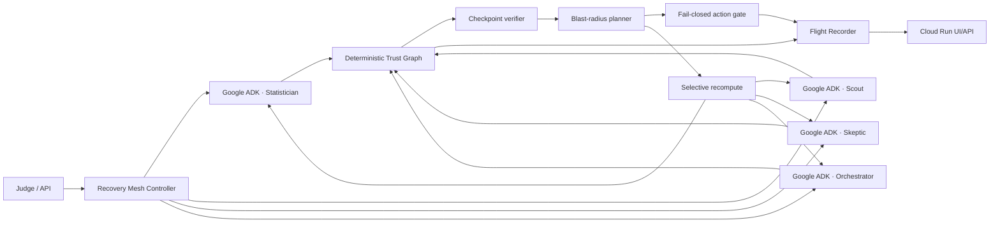

# EvidenceBound Recovery Mesh

> Trust-aware flight recorder and self-healing engine for autonomous agent fleets.

Recovery Mesh detects when a checkpoint in an agent workflow becomes untrustworthy,
computes the exact downstream trust blast radius, blocks unsafe actions, preserves still-
verifiable work, recomputes only the affected branch, re-verifies the new state, and resumes
only when the final policy gate passes.

## Judge thesis

```text
TRUST BREAK
  -> BLAST RADIUS
  -> ACTION BLOCKED
  -> SAFE WORK REUSED
  -> AFFECTED BRANCH RECOMPUTED
  -> VERIFIED RECOVERY
```

## Core invariant

**Persisted memory is not automatically trusted memory.**

Gemini output never overrides deterministic trust, provenance, integrity, dependency, policy,
or side-effect gates.

## Hackathon boundary

This is a new, isolated Google All Things Agentic Hackathon 2026 project. No SignalReview
production source or prior EvidenceBound implementation source is copied into this repository.
See [`PREEXISTING_WORK.md`](PREEXISTING_WORK.md) for the disclosure and clean-room boundary.

## Architecture



The public judge deployment is configured to use **Google ADK + Gemini**. The deterministic
executor exists only for credential-free unit/contract tests and is surfaced as
`deterministic_test`; there is no silent fallback from a failed Google invocation.

## Trust graph

The bounded clean-room workload is:

```text
fixture_snapshot -----+----> statistician ----+
                      |                        |
history_snapshot -----+                        +--> skeptic --> orchestrator --> publish_action
                      |                        |                   ^
                      +----> scout ------------+                   |
policy_rules -----------------------------------------------------+
```

Every checkpoint binds:

- run/checkpoint/agent IDs and versions;
- dependency checkpoint IDs;
- **actual parent output digests** as input digests;
- evidence/tool-result digests where applicable;
- policy version;
- structured output digest;
- trust state (`VERIFIED`, `INVALIDATED`, `RECOMPUTE`, `BLOCKED`);
- provenance/integrity metadata and timestamps.

## Controlled trust breaks

All demo faults are visibly labeled controlled faults and enter the same trust contracts used
by runtime verification:

- `stale_evidence` — invalidates `history_snapshot` and exactly its downstream branch;
- `malformed_worker` — strict agent-output schema failure at `scout`;
- `policy_drift` — policy version drift invalidates policy-dependent state.

The Recovery Mesh computes the rerun plan. A judge never selects which agents to rerun.

## Execution modes

### Deterministic test mode

Default when no environment override is set:

```bash
RECOVERY_MESH_EXECUTION_MODE=deterministic python -m pytest
```

This validates graph/recovery behavior without credentials. It **does not** claim Gemini,
ADK, model-call, or token execution.

### Google ADK / Vertex AI mode

The Cloud Run deployment sets:

```text
RECOVERY_MESH_EXECUTION_MODE=google_adk
GOOGLE_GENAI_USE_VERTEXAI=TRUE
RECOVERY_MESH_MODEL=gemini-3.5-flash
```

Each agent checkpoint invokes a fresh bounded ADK agent. Execution receipts retain provider,
model, elapsed time, ADK invocation IDs/authors, and token usage when the ADK event exposes it.
If ADK/Gemini is unavailable or the worker violates the strict output contract, the request
fails closed rather than silently switching to deterministic output.

## Fleet-scale proof without 100 LLM calls

The live judge workflow intentionally keeps four specialized Gemini/ADK roles so the causal
story stays understandable and bounded. Separately, a deterministic scale probe constructs
**100 synthetic agent checkpoints** across independent branches and measures the same exact
blast-radius planner. This proves graph-scale reuse behavior without pretending that 100 model
calls are necessary or cost-effective.

```bash
PYTHONPATH=src python scripts/benchmark-scale.py
```

The receipt is explicitly labeled `deterministic_synthetic_scale_probe`; it is not evidence of
100 live Gemini invocations.

## Measured recovery economics

The benchmark compares:

1. a full four-agent restart; and
2. the Recovery Mesh selective rerun set.

In deterministic test mode only checkpoint/agent execution counts and elapsed time are
reported. In live Google mode the benchmark actually executes both paths and additionally
records model calls and input/output token usage when returned by ADK events. Any percentage
shown in the UI is explicitly scoped to that controlled run; no general savings claim is made.

## Local verification

```bash
python -m pytest --cov=recovery_mesh --cov-branch --cov-report=term-missing
python -m py_compile app/agent.py src/recovery_mesh/*.py
bash -n scripts/gcp-owner-bootstrap.sh scripts/gcp-live-preflight.sh scripts/deploy-cloud-run.sh scripts/smoke-cloud-run.sh
```

`src/recovery_mesh/google_adk.py` is intentionally excluded from credential-free unit coverage;
it is owned by the live ADK/Gemini integration gate. A local core PASS is not a Google
integration PASS.

The full CI also runs Ruff, mypy, secret scanning, and a Docker build.

## Run the local Flight Recorder

```bash
PYTHONPATH=src uvicorn recovery_mesh.api:app --host 127.0.0.1 --port 8080
```

Then open `http://127.0.0.1:8080`. For an automated visual flow:

```text
/?autorun=stale_evidence
/?autorun=stale_evidence&recover=1
```

These query parameters call the real API/runtime; they do not fabricate UI state.

## Cloud Run deployment

Prerequisites are intentionally not hidden: a Google Cloud project with billing, required
permissions, Application Default Credentials / deploy authentication, and access to the
configured Gemini model.

For the first deployment, run the owner bootstrap once from an authenticated Google Cloud
Shell. It performs live Gemini preflight, creates separate least-privilege runtime/build
identities, makes the judge service public once, deploys the bounded Cloud Run service, and
creates keyless GitHub Workload Identity Federation restricted to this repository and `main`
branch. No service-account key is created or exported.

```bash
export GOOGLE_CLOUD_PROJECT=your-project-id
export GOOGLE_CLOUD_RUN_REGION=europe-west1
export GOOGLE_CLOUD_LOCATION=global
export RECOVERY_MESH_MODEL=gemini-3.5-flash
./scripts/gcp-owner-bootstrap.sh
```

Subsequent authorized deployments use `./scripts/deploy-cloud-run.sh`; recurring deploy
credentials do not receive permission to enable APIs, mutate project IAM, or change public
access. Source builds run as the dedicated `recovery-mesh-build` identity and revisions run as
the separate `recovery-mesh-runtime` identity. The deployment is bounded to `min=0`, `max=1`,
one CPU and 512 MiB. Every deploy first performs a real Gemini
call and then runs the end-to-end live smoke gate requiring Google ADK receipts, exact
stale-evidence blast radius, blocked action, preserved Scout checkpoint, selective three-agent
rerun, and final `VERIFIED` action state.

## Security and cost posture

- no secrets in source, receipts, or UI;
- bounded controlled demo inputs;
- deterministic fail-closed trust/policy gates;
- side-effect idempotency keys;
- no automatic fallback from Google execution to fake/local output;
- Cloud Run scale-to-zero target with max one instance;
- owner-funded spend is not assumed;
- extra Gemini Enterprise Agent Platform services are not claimed until entitlement and real
  invocation are verified.

## Current evidence classes

| Gate | Status semantics |
|---|---|
| Deterministic DAG / recovery / API tests | executable local evidence |
| Google ADK construction | requires installed ADK dependency |
| Live Gemini / Vertex execution | requires real Google credentials/project |
| Cloud Run deployment | requires authenticated `gcloud` project access |
| Browser visual acceptance | separate hosted/browser gate |
| Gemini Enterprise Agent Platform add-ons | not part of the claimed runtime until verified |
