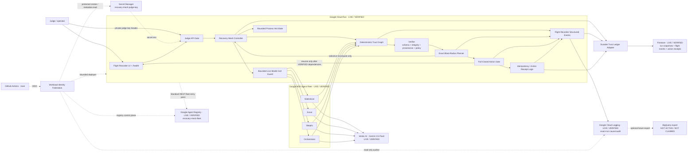
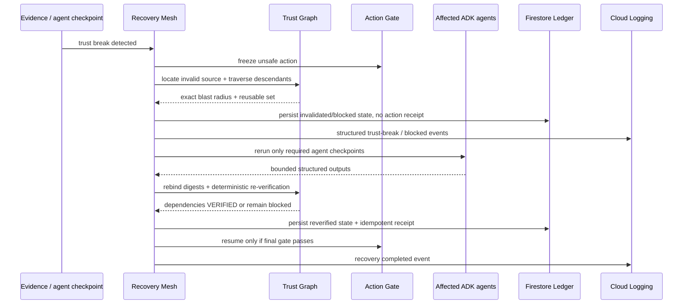
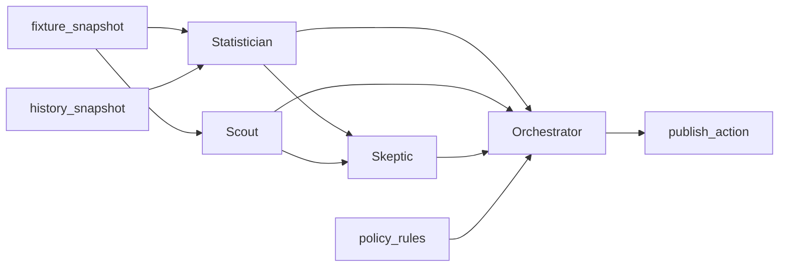

# EvidenceBound Recovery Mesh — architecture source

This document is the canonical source for the final Devpost architecture diagram. `LIVE / VERIFIED` labels are used only for capabilities backed by production or authenticated Google control-plane receipts.

Current verified Google path:

- Cloud Run revision `evidencebound-recovery-mesh-00007-bjm`;
- Google ADK `2.7.0` + Vertex AI / Gemini 3.5 Flash;
- Firestore Durable Trust Ledger;
- Google Cloud Logging exact-run causal audit;
- Secret Manager protected judge access;
- Workload Identity Federation for keyless GitHub identities;
- Google Agent Registry fleet catalog/discovery entry.

BigQuery, Agent Runtime, Memory Bank and Model Armor are not shown as active integrations.

## Runtime architecture



## Trust authority boundary

The LLM and persistence layer are not trust authorities.

Gemini/ADK may produce bounded structured analysis. Firestore may persist prior state. Cloud Logging may make the causal sequence externally auditable. Google Agent Registry may catalog/discover the fleet endpoint.

Only deterministic Recovery Mesh code owns:

- checkpoint state transitions;
- provenance and integrity checks;
- dependency traversal;
- exact blast-radius calculation;
- action blocking;
- reusable-vs-recompute classification;
- persisted-state revalidation;
- final policy gate;
- duplicate side-effect suppression.

No model output, stored row/document, log entry, or Registry record can mark itself `VERIFIED` or authorize `publish_action`.

## Firestore Durable Trust Ledger — live verified boundary

Revision `evidencebound-recovery-mesh-00007-bjm` runs with:

```text
persistence.provider=firestore
persistence.durable=true
Firestore database=(default)
Firestore location=europe-west1
```

The Durable Trust Ledger persists:

- run snapshots;
- checkpoint state required for rehydration;
- Flight Recorder events;
- durable action receipts used by the idempotency boundary.

Production acceptance `run-4f1eba151be7` verified:

```text
FIRESTORE_BLOCKED_RECEIPT_COUNT=PASS count=0
DURABLE_BLOCKED=PASS action=BLOCKED receipt=absent persisted_trust=validated
DURABLE_RECOVERY=PASS receipt=present rehydration=trusted
FIRESTORE_RECOVERED_RECEIPT_COUNT=PASS count=1
```

The rule is deliberate: **persisted state is not automatically trusted state**. Rehydrated checkpoints must still satisfy dependency/input digest, provenance, integrity and active-policy requirements.

The exact live acceptance did not deliberately kill the Cloud Run instance between persistence and replay. Repository tests cover crash/restart semantics; production evidence above proves the active Firestore data path, durable receipt cardinality and deterministic rehydration gate on the deployed revision.

## Google Cloud Logging — live verified audit boundary

The Flight Recorder emits structured causal events from the runtime. The `cloud-proof` job in workflow `33196523402` authenticated through the separate read-only auditor identity and queried Cloud Logging for the exact acceptance run `run-4f1eba151be7`.

Verified result:

```text
EXACT_RUN_CLOUD_LOGGING=PASS run_id=run-4f1eba151be7
GCP_PROOF_RECEIPT=PASS
```

Observed sequence included:

```text
TRUST_BREAK_DETECTED
BLAST_RADIUS_COMPUTED
ACTION_BLOCKED
CHECKPOINT_REUSED
RECOMPUTE_STARTED
CHECKPOINT_REVERIFIED
ACTION_RESUMED
RECOVERY_COMPLETED
```

Cloud Logging is an audit surface only. Recovery Mesh does not depend on a log entry to authorize recovery.

## Verified Agent Registry boundary

The Recovery Mesh Cloud Run endpoint is registered as a **Standard REST fleet entry point** in Google Agent Registry, location `global`.

Verified historical control-plane receipt:

```text
Workflow: 31871557186
AGENT_REGISTRY=PASS operation=created location=global transport=rest-v1 discovery=service-registry-resource
AGENT_REGISTRY_SERVICE=projects/evidencebound-rm-c977c1/locations/global/services/recovery-mesh-fleet
AGENT_REGISTRY_AGENT=projects/457699623691/locations/global/agents/agentregistry-00000000-0000-0000-a7f5-b9837959f789
AGENT_REGISTRY_INTERFACE=https://evidencebound-recovery-mesh-i3lzjodgra-ew.a.run.app
AGENT_REGISTRY_DISCOVERY=PASS
```

This is catalog/discovery control plane, not trust authority. The Registry entry represents the Recovery Mesh fleet endpoint; the submission does not claim separate Registry entries for Statistician, Scout, Skeptic or Orchestrator.

## Checkpoint contract

Each material checkpoint binds:

```text
run_id
checkpoint_id
agent_id + agent_version (when applicable)
dependency_checkpoint_ids
actual parent-output digests
input/evidence/tool-result digests
policy_version
structured_output_digest
verification_state
provenance metadata
integrity metadata
created_at / verified_at
side_effect_key (actions)
```

Minimum trust states:

```text
VERIFIED
INVALIDATED
RECOMPUTE
BLOCKED
```

## Recovery sequence



## Judge workload dependency graph



For controlled `stale_evidence` at `history_snapshot`:

```text
INVALID SOURCE: history_snapshot
AFFECTED AGENTS: Statistician -> Skeptic -> Orchestrator
BLOCKED ACTION: publish_action
REUSED AGENT: Scout
```

Controlled faults use the same runtime contracts as ordinary verification failures and are visibly labeled fixtures.

## Public judge boundary

Unauthenticated users may load the Flight Recorder and `/health`. Run/read/fault/recovery APIs pass through the private judge API gate. A missing or incorrect supplied key returns `401` before model execution.

The browser stores the entered key only in tab-scoped `sessionStorage` and sends it as `X-Recovery-Mesh-Judge-Key`. The secret value is stored in Google Secret Manager and is not committed or embedded in the public UI.

A second guard bounds live provider reservations per Cloud Run process (`64` by deployment default). This reduces stray-call exposure but is not represented as a billing cap.

## Google Cloud isolation

Canonical production target:

```text
Project ID: evidencebound-rm-c977c1
Project number: 457699623691
Cloud Run region: europe-west1
Vertex location: global
Model target: gemini-3.5-flash
Current verified revision: evidencebound-recovery-mesh-00007-bjm
Firestore database: (default)
Firestore location: europe-west1
Judge secret: recovery-mesh-judge-key:1
Agent Registry location: global
Agent Registry Service: recovery-mesh-fleet
```

Bounded identities include:

- `recovery-mesh-runtime`: live runtime identity with Vertex execution and Firestore data-plane access required by the service;
- `recovery-mesh-build`: source-build identity;
- `recovery-mesh-deployer`: keyless GitHub deployment identity, protected-smoke secret access, and read-only Firestore metadata verification;
- `recovery-mesh-auditor`: separate keyless read-only identity used by exact-run Cloud Logging proof;
- the existing deployer also performs the bounded Agent Registry control-plane workflow.

Normal GitHub deploys verify Firestore rather than provisioning it. One-time owner/bootstrap operations remain separate from recurring deployment authority.

## Evidence classes

Keep these visually separate in the final diagram/demo:

1. **Live production runtime:** Cloud Run + Google ADK + Gemini/Vertex + Secret Manager.
2. **Live durable state:** Firestore Durable Trust Ledger, with deterministic revalidation before reuse.
3. **Live external audit:** Google Cloud Logging exact-run causal sequence under separate auditor identity.
4. **Live catalog/discovery:** Google Agent Registry fleet entry point.
5. **Deterministic recovery authority:** Trust Graph, verification, blast radius and fail-closed action gate.
6. **Bounded hot state:** process-local objects/caches used while the revision is serving a request; not the durable source of truth.
7. **Unverified extensions:** BigQuery export, Agent Runtime, Memory Bank, Model Armor.
8. **Synthetic scale probe:** 100 synthetic agent checkpoints; proves deterministic graph scaling, not 100 Gemini calls.

The final architecture image and Devpost description must match this boundary exactly.

Canonical production evidence: [`FORTIFIED_PRODUCTION_RECEIPT_2026-08-28.md`](FORTIFIED_PRODUCTION_RECEIPT_2026-08-28.md).
