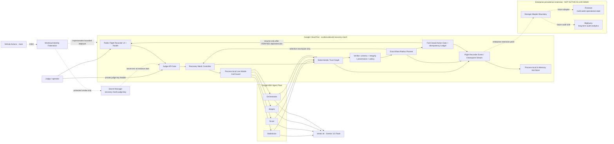
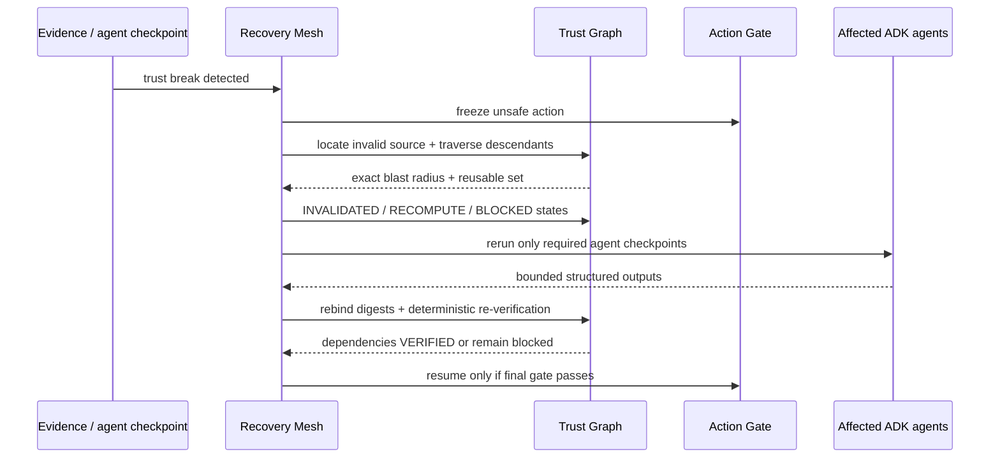
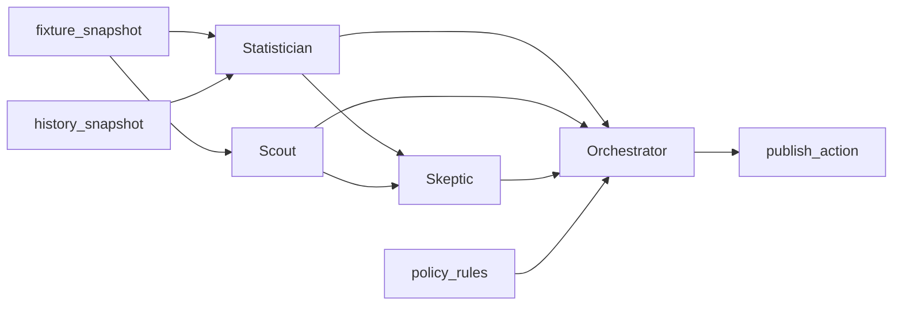

# EvidenceBound Recovery Mesh — architecture source

This document is the canonical source for the final Devpost architecture diagram. The current Google Cloud deployment has verified production receipts, so `LIVE / VERIFIED` labels refer only to the deployed Cloud Run + Google ADK + Vertex AI path demonstrated by acceptance. Enterprise persistence boxes are explicitly architectural extension points and are not presented as active integrations.

## Runtime architecture



The Cloud Run URL remains publicly reachable for judge usability while state-changing/run APIs require the private testing key supplied through Devpost's judge-only instructions. The key is generated during first bootstrap, stored in Secret Manager, and never committed or embedded in the UI. The browser keeps an entered key only in tab-scoped `sessionStorage` and sends it as `X-Recovery-Mesh-Judge-Key`.

## Intentional production freeze and enterprise persistence boundary

The current hackathon deployment intentionally keeps run state in a **process-local in-memory hot store**. This was a deliberate final-submission decision after the Google Cloud production path reached verified acceptance. Adding a new database dependency immediately before judging would introduce fresh IAM, availability, timeout and latency failure modes into a path that is already proven to execute the required trust-break and recovery journey.

The Flight Recorder emits structured checkpoint/event state that is independent of a specific durable database. The architecture therefore reserves an explicit **storage-adapter extension point** after that stream. In an enterprise deployment, a durable implementation can persist the same schema asynchronously to services such as:

- **Firestore** for multi-week operational state and cross-session retention;
- **BigQuery** for long-term compliance/audit analytics and data-sovereignty reporting workflows.

These are **enterprise extension targets, not active services in this live submission**. Recovery Mesh does not claim that the current Cloud Run revision writes to Firestore or BigQuery, and no fictitious persistence receipt is presented.

The design principle is that persistence availability must not become trust authority. A durable store may retain more history, but deterministic verification, provenance/integrity checks, dependency invalidation, blast-radius calculation and the fail-closed action gate remain authoritative regardless of the storage provider.

## Trust authority boundary

The LLM is not the trust authority.

Gemini/ADK may produce bounded structured analysis. The deterministic Recovery Mesh owns:

- checkpoint state transitions;
- provenance/integrity checks;
- dependency traversal;
- exact blast-radius calculation;
- action blocking;
- selection of reusable vs recomputed checkpoints;
- final policy gate;
- duplicate side-effect suppression.

No model output can mark itself `VERIFIED`, authorize an action, or override an invalidation.

## Checkpoint contract

Each material checkpoint binds:

```text
run_id
checkpoint_id
agent_id + agent_version (when applicable)
dependency_checkpoint_ids
actual parent-output digests
input/evidence/tool-result digests
policy_version
structured_output_digest
verification_state
provenance metadata
integrity metadata
created_at / verified_at
side_effect_key (actions)
```

Minimum trust states:

```text
VERIFIED
INVALIDATED
RECOMPUTE
BLOCKED
```

## Recovery sequence



## Judge workload dependency graph



For the controlled `stale_evidence` fault at `history_snapshot`:

```text
INVALID SOURCE: history_snapshot
AFFECTED AGENTS: Statistician -> Skeptic -> Orchestrator
BLOCKED ACTION: publish_action
REUSED AGENT: Scout
```

The same runtime contracts handle controlled fault injection and normal verification failures; controlled faults are labeled as fixtures and are never presented as live provider truth.

## Public judge boundary

Unauthenticated requests may load the Flight Recorder and `/health`. Run snapshots and all POST operations (`start`, `fault`, `recover`) pass through the judge API gate. Live mode without a configured judge secret returns `503`; a missing/incorrect supplied key returns `401` before an agent/model call.

A second guard bounds live provider reservations per Cloud Run process (`64` by deployment default). That guard reduces stray-call exposure but is explicitly **not** a billing/spend cap because a new process/revision resets it.

## Google Cloud isolation

Canonical deployment target:

```text
Project ID: evidencebound-rm-c977c1
Project number: 457699623691
Cloud Run region: europe-west1
Vertex location: global
Model target: gemini-3.5-flash
Current verified revision: evidencebound-recovery-mesh-00005-82k
Judge secret: recovery-mesh-judge-key:1
```

First bootstrap creates separate identities:

- `recovery-mesh-runtime`: Vertex invocation runtime + accessor only to the dedicated judge secret;
- `recovery-mesh-build`: source-build identity;
- `recovery-mesh-deployer`: keyless GitHub deployment identity + accessor to the dedicated judge secret only for protected deployment smoke.

The bootstrap checks exact project identity, project number, hackathon label, lifecycle state, and billing before mutation. Recurring GitHub deployment is restricted by Workload Identity Federation to repository ID `1334014784`, owner `moneyparking`, and `refs/heads/main`.

## Evidence classes

Keep these visually separate in the final diagram/demo:

1. **Live production path:** Cloud Run + Google ADK + Gemini/Vertex + Secret Manager, backed by actual acceptance receipts.
2. **Deterministic recovery authority:** Trust Graph, verification, blast radius, action gate.
3. **Current hot state:** process-local in-memory store used by the live bounded demo.
4. **Enterprise persistence extension:** Firestore / BigQuery adapter targets, explicitly not active in the live submission.
5. **Synthetic fleet-scale probe:** 100 synthetic agent checkpoints; proves deterministic graph scaling and does not claim 100 Gemini calls.

The final architecture PNG uploaded to Devpost must match this truth boundary and must not include unverified Gemini Enterprise Agent Platform add-ons as active services.
