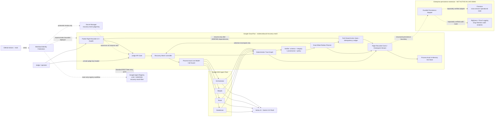
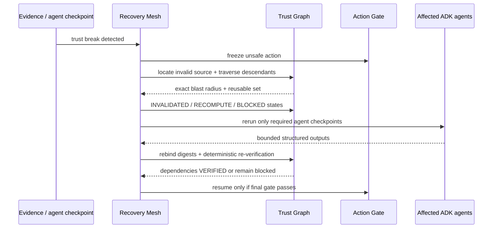
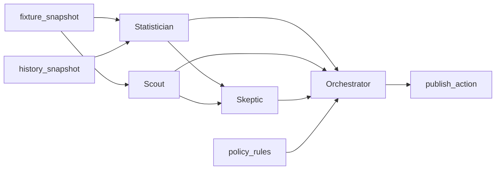

# EvidenceBound Recovery Mesh — architecture source

This document is the canonical source for the final Devpost architecture diagram. `LIVE / VERIFIED` labels refer only to capabilities backed by production/control-plane receipts. The current verified Google path includes Cloud Run + Google ADK + Vertex AI + Secret Manager and a Google Agent Registry catalog/discovery entry for the Recovery Mesh fleet endpoint. Enterprise persistence boxes remain explicitly architectural extension points and are not presented as active integrations.

## Runtime architecture



The Cloud Run URL remains publicly reachable for judge usability while state-changing/run APIs require the private testing key supplied through Devpost's judge-only instructions. The key is generated during first bootstrap, stored in Secret Manager, and never committed or embedded in the UI. The browser keeps an entered key only in tab-scoped `sessionStorage` and sends it as `X-Recovery-Mesh-Judge-Key`.

## Verified Agent Registry boundary

The existing Recovery Mesh Cloud Run endpoint is manually registered as a **Standard REST fleet entry point** in Google Agent Registry, location `global`. Registration uses the existing keyless WIF deployer identity and the stable Agent Registry REST v1 control plane. The registration workflow waits for Google's long-running operation and does not report PASS until the Registry-generated read-only `Agent` is observable and GET-verifiable.

Verified receipt:

```text
Workflow: 31871557186
AGENT_REGISTRY=PASS operation=created location=global transport=rest-v1 discovery=service-registry-resource
AGENT_REGISTRY_SERVICE=projects/evidencebound-rm-c977c1/locations/global/services/recovery-mesh-fleet
AGENT_REGISTRY_AGENT=projects/457699623691/locations/global/agents/agentregistry-00000000-0000-0000-a7f5-b9837959f789
AGENT_REGISTRY_INTERFACE=https://evidencebound-recovery-mesh-i3lzjodgra-ew.a.run.app
AGENT_REGISTRY_DISCOVERY=PASS
```

This is a catalog/discovery integration, not a trust-authority integration. Agent Registry cannot mark a Recovery Mesh checkpoint `VERIFIED`, calculate blast radius, override provenance/policy/integrity checks, or authorize `publish_action`.

The Registry entry represents the **Recovery Mesh fleet endpoint**. The submission does not claim separate Registry entries for Statistician, Scout, Skeptic, or Orchestrator.

## Verified persistence boundary

The deployed hackathon slice keeps run state in a **process-local in-memory hot store**. That is the current verified runtime boundary and is **not evidence of durable multi-week context**.

The Flight Recorder emits structured `FlightEvent` records, while the Trust Graph exposes checkpoint objects carrying stable run/checkpoint IDs, dependency metadata, output/evidence digests, policy version, provenance/integrity metadata and timestamps. That existing schema creates a clear persistence boundary without making the persistence provider part of trust authority.

A separately verified enterprise adapter can persist the same structured records to:

- **Firestore** for durable cross-session operational state;
- **BigQuery / Cloud Logging** for long-retention audit analysis and reporting.

Those services are **enterprise extension targets, not active services in this live submission**. Recovery Mesh does not claim that the current Cloud Run revision writes to Firestore or BigQuery, and the architecture diagram must not imply that a future persistence box satisfies the Fortified multi-week-context requirement today.

The design principle is that persistence availability must not become trust authority. A durable store can improve retention and restart survivability, but deterministic verification, provenance/integrity checks, dependency invalidation, blast-radius calculation and the fail-closed action gate remain authoritative regardless of the storage provider.

## Trust authority boundary

The LLM is not the trust authority.

Gemini/ADK may produce bounded structured analysis. The deterministic Recovery Mesh owns:

- checkpoint state transitions;
- provenance/integrity checks;
- dependency traversal;
- exact blast-radius calculation;
- action blocking;
- selection of reusable vs recomputed checkpoints;
- final policy gate;
- duplicate side-effect suppression.

No model output can mark itself `VERIFIED`, authorize an action, or override an invalidation.

## Checkpoint contract

Each material checkpoint binds:

```text
run_id
checkpoint_id
agent_id + agent_version (when applicable)
dependency_checkpoint_ids
actual parent-output digests
input/evidence/tool-result digests
policy_version
structured_output_digest
verification_state
provenance metadata
integrity metadata
created_at / verified_at
side_effect_key (actions)
```

Minimum trust states:

```text
VERIFIED
INVALIDATED
RECOMPUTE
BLOCKED
```

## Recovery sequence



## Judge workload dependency graph



For the controlled `stale_evidence` fault at `history_snapshot`:

```text
INVALID SOURCE: history_snapshot
AFFECTED AGENTS: Statistician -> Skeptic -> Orchestrator
BLOCKED ACTION: publish_action
REUSED AGENT: Scout
```

The same runtime contracts handle controlled fault injection and normal verification failures; controlled faults are labeled as fixtures and are never presented as live provider truth.

## Public judge boundary

Unauthenticated requests may load the Flight Recorder and `/health`. Run snapshots and all POST operations (`start`, `fault`, `recover`) pass through the judge API gate. Live mode without a configured judge secret returns `503`; a missing/incorrect supplied key returns `401` before an agent/model call.

A second guard bounds live provider reservations per Cloud Run process (`64` by deployment default). That guard reduces stray-call exposure but is explicitly **not** a billing/spend cap because a new process/revision resets it.

## Google Cloud isolation

Canonical deployment target:

```text
Project ID: evidencebound-rm-c977c1
Project number: 457699623691
Cloud Run region: europe-west1
Vertex location: global
Model target: gemini-3.5-flash
Current verified revision: evidencebound-recovery-mesh-00005-82k
Judge secret: recovery-mesh-judge-key:1
Agent Registry location: global
Agent Registry Service: recovery-mesh-fleet
```

First bootstrap creates separate identities:

- `recovery-mesh-runtime`: Vertex invocation runtime + accessor only to the dedicated judge secret;
- `recovery-mesh-build`: source-build identity;
- `recovery-mesh-deployer`: keyless GitHub deployment identity + accessor to the dedicated judge secret only for protected deployment smoke; later granted the bounded `Agent Registry API Editor` role for the separate catalog-registration workflow.

The bootstrap checks exact project identity, project number, hackathon label, lifecycle state, and billing before mutation. Recurring GitHub deployment is restricted by Workload Identity Federation to repository ID `1334014784`, owner `moneyparking`, and `refs/heads/main`. Agent Registry registration is also main-only and uses the same keyless identity without changing the Cloud Run revision.

## Evidence classes

Keep these visually separate in the final diagram/demo:

1. **Live production path:** Cloud Run + Google ADK + Gemini/Vertex + Secret Manager, backed by actual acceptance receipts.
2. **Live catalog/discovery control plane:** Google Agent Registry fleet entry point, backed by workflow `31871557186` and generated read-only Agent verification.
3. **Deterministic recovery authority:** Trust Graph, verification, blast radius, action gate.
4. **Current hot state:** process-local in-memory store used by the live bounded demo.
5. **Enterprise persistence extension:** Firestore / BigQuery / Cloud Logging adapter targets, explicitly not active in the live submission.
6. **Synthetic fleet-scale probe:** 100 synthetic agent checkpoints; proves deterministic graph scaling and does not claim 100 Gemini calls.

The final architecture PNG uploaded to Devpost must match this truth boundary. It may show Agent Registry as `LIVE / VERIFIED`, but it must not show Agent Runtime, Memory Bank, Model Armor, Firestore persistence, BigQuery export, or other unverified platform services as active.
